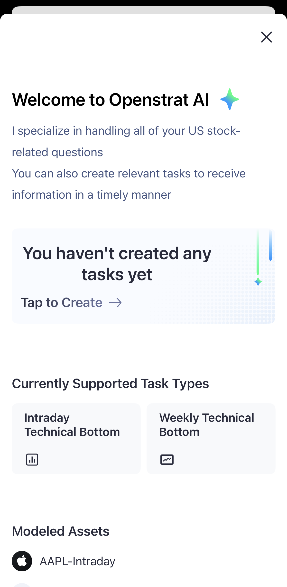
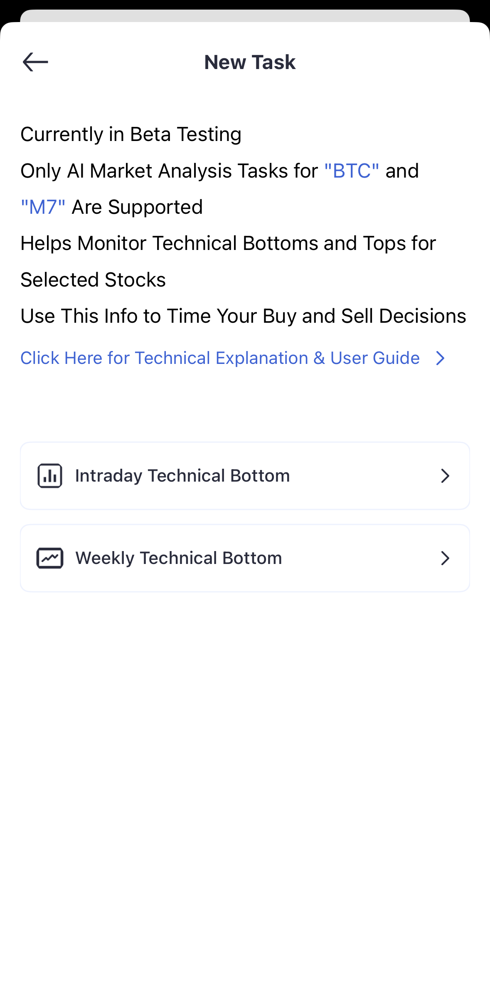
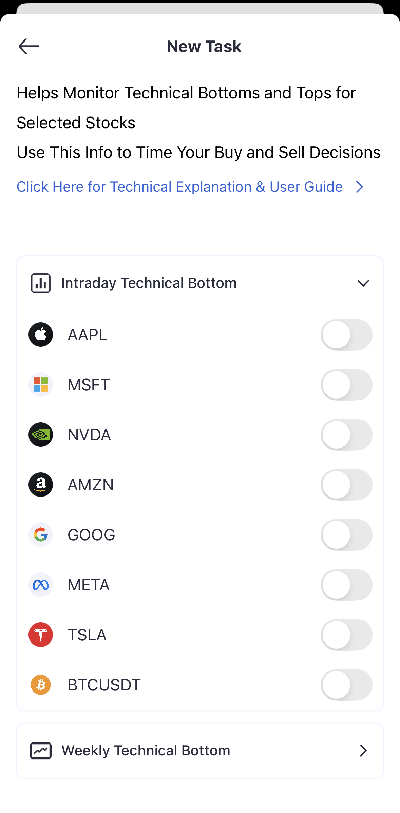

[中](/zh/documentation/getting-started) / [En](/en/documentation/getting-started)

## Registration & Sign-in
- Visit website or App Store
- Login via Google / Apple / Discord
> We do not use username+password. Token-based login is safer (time-limited, scoped). Enable 2FA (coming soon).

## UI tour (5 mins)

## First-time guide
1. Browse the homepage
2. Create your first task (e.g., BTCUSDT or AAPL)
3. Learn how notifications are delivered
4. Try a quick chat with the AI assistant

## Create your first task
Tap “Tap to Create”, pick a symbol and turn on alerts. Stocks are monitored intraday; crypto is monitored 24/7.
Currently covers Magnificent-7 (AAPL/MSFT/NVDA/AMZN/GOOG/META/TSLA) and BTC.

## Basic settings
▶ Notifications: app push, task alerts, conditions & channels

▶ Account security: 2FA (coming soon)

▶ Personalization: theme, default view, timezone & formats

## Mobile
Install → sign in → allow push. Gestures: swipe left on tasks (quick actions), pull-to-refresh, long-press.
Some features work offline and sync when back online.

## Common issues
▶ No push received: check app permission/system notifications/Do Not Disturb/network; on iOS enable Banners

▶ Account sync: ensure same account; re-login/clear cache

▶ Task creation failed: verify ticker; task limit and connection; try AI-chat creation

▶ Abnormal data: check timezone/version; refresh/restart; clear cache

