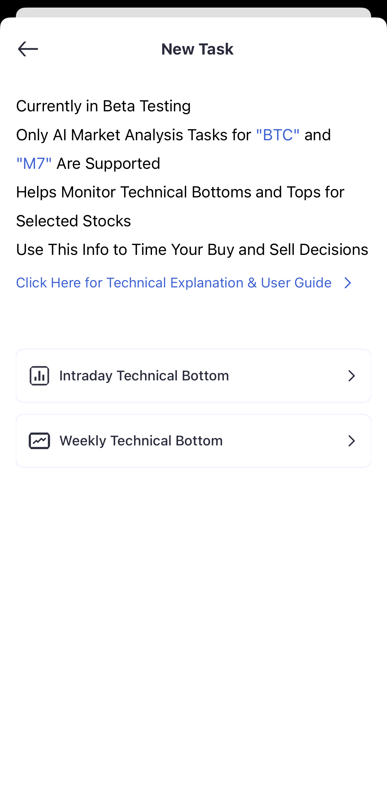

## 账户注册与登录
- 访问官网或从 App Store 下载
- 使用 Google / Apple / Discord 登录
> 我们不使用“用户名+密码”。登录令牌具备时效性与受限权限，更安全。建议开启 2FA（即将上线）。

## 界面导览（5 分钟）

## 第一次使用指南
1. 登录并浏览首页
2. 创建第一个任务（如 BTCUSDT 或 AAPL）
3. 了解如何接收和查看任务通知
4. 与 AI 助手进行简单对话

## 创建你的第一个任务
在欢迎界面点击 “Tap to Create”，选择关注的标的并打开开关。股票在盘中实时检测与推送；加密 24/7 检测并即时推送。
当前覆盖 Magnificent-7（AAPL/MSFT/NVDA/AMZN/GOOG/META/TSLA）与 BTC。

## 基础设置
▶ 通知设置：系统推送、任务推送、通知条件与渠道

▶ 账户安全：2FA（即将上线）

▶ 个性化：主题、默认展示、时区与数据格式

## 移动端使用说明
下载安装 → 登录 → 允许推送权限；常用手势：左滑任务（快捷操作）、下拉刷新、长按更多；部分功能支持离线，联网后同步。

## 常见问题（节选）
▶ 未收到推送：检查 App 推送权限/系统通知/勿扰模式/网络；iOS 检查“横幅”是否开启

▶ 账户同步：确保相同账户登录；尝试退出重登/清缓存

▶ 任务创建失败：核对股票代码；检查任务上限与网络状态；尝试改用 AI 对话创建

▶ 数据异常：检查时区/版本；刷新/重启；清缓存

